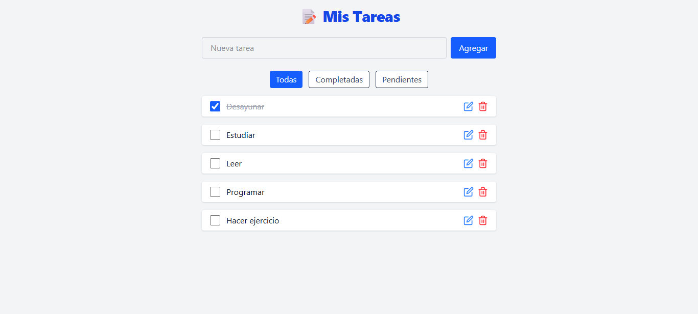

# Todo App con MongoDB

Aplicación web de tareas desarrollada con React, Express y MongoDB Atlas. Permite crear, editar, completar y eliminar tareas, y guarda los datos en la nube.

---

## Demo

[Ver demo en Vercel](https://tusitio.vercel.app)
[Backend en Render](https://tuapi.onrender.com)

---

## Tecnologías usadas
- ✅ React + Vite
- ✅ Tailwind CSS
- ✅ Node.js + Express
- ✅ MongoDB Atlas (base de datos en la nube)
- ✅ Fetch API

---

## Funcionalidades

- Agregar nuevas tareas
- Marcar tareas como completadas o pendientes
- Editar el texto de una tarea
- Eliminar tareas con confirmaciones
- Filtros por estado: todas, completadas, pendientes

---

## Captura de pantalla



---

## Instalación local

1. Clona el repositorio

```bash
git clone https://github.com/tuusuario/turepo.git
cd turepo
```

2. Instala dependencias
```bash
npm install
```

3. Crear un archivo .env con la URL de tu MongoDB Atlas si estás probando el backend.
4. Corre el frontend:

```bash
npm run dev
```